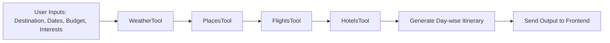

# AI Travel Planner

## Problem Statement
Users often struggle with planning trips due to:
- Finding flights, hotels, tourist spots
- Building a daily plan requires browsing multiple websites and tools.
- Most people want personalized, quick, and flexible travel planning.

## Project Objective
### AI Travel Bot Specification

### Objective
Build a Conversational AI Agent that assists users in planning travel itineraries based on their preferences.

### Core Features

### Input Requirements
- Takes basic user inputs including:
  - Destination
  - Budget range
  - Travel dates
  - Preferences (e.g., adventure, luxury, family-friendly)

### Output Capabilities
- Generates day-wise travel itineraries containing:
  - **Places to visit** with timing suggestions
  - **Flight options** (when applicable)
  - **Hotel recommendations** matching budget
  - **Local weather** forecast for travel dates

### Advanced Features
- **Preference Memory**:
  - Remembers user preferences across sessions
  - Learns from user feedback and adjustments

- **Interactive Planning**:
  - Can revise existing plans based on follow-up queries
  - Accepts modifications to any itinerary element
  - Handles multi-turn conversations about trip details

### Technical Considerations
- Natural language understanding for flexible input
- Integration with travel APIs (flights, hotels, weather)
- Personalization engine for preference tracking
- Conversational flow management for revisions


## Technology Stack

| Layer               | Technology                                                                 |
|---------------------|---------------------------------------------------------------------------|
| 🖥️ **Frontend**      | Streamlit – for user interface (can still call FastAPI endpoints)         |
| ⚙️ **Backend API**   | FastAPI – clean separation from frontend, handles requests & serves agent |
| 🔁 **Agent Core**    | LangGraph – for AI agent workflows, memory, tools                         |
| 🧠 **LLM (AI Brain)**| Groq API with LLaMA 3 Instruct (8B)                                       |
| 🧰 **Tools**         | Weather, Places, Flights (custom LangGraph tools)                         |
| 🧠 **Memory**        | Redis / LangGraph in-memory (optional for context persistence)            |
| 📖 **Vector DB**     | FAISS / Chroma (for travel blogs, guide RAG, embeddings, etc.)            |
| 🔍 **Embeddings**    | sentence-transformers (e.g., all-MiniLM-L6-v2)                            |
| 🔐 **Secrets**       | .env + python-dotenv for managing API keys securely                       |

### Alternative List Version
- 🖥️ **Frontend**: Streamlit  
  _(Can call FastAPI endpoints directly)_

- ⚙️ **Backend API**: FastAPI  
  _(Clean architecture, request handling, agent serving)_

- 🔁 **Agent Core**: LangGraph  
  _(Workflow orchestration, memory management, tool integration)_

- 🧠 **LLM**: Groq API + LLaMA 3 Instruct (8B)  
  _(High-speed inference engine)_

- 🧰 **Tools Suite**:
  - Weather API integration
  - Places search tool
  - Flights lookup tool  
    _(All implemented as LangGraph tools)_

- 🧠 **Memory Options**:
  - Redis (persistent)
  - LangGraph in-memory  
    _(For conversation context)_

- 📖 **Vector Databases**:
  - FAISS (local)
  - Chroma (scalable)  
    _(For travel content RAG)_

- 🔍 **Embeddings**:  
  `all-MiniLM-L6-v2` via sentence-transformers  
  _(Balance of speed & accuracy)_

- 🔐 **Security**:  
  `.env` + `python-dotenv`  
  _(Secure API key management)_

## Architecture Overview

```mermaid
flowchart TD
  A[User Interface\nReact/Next.js] --> B[FastAPI Backend\nAPI Layer]
  B --> C[LangGraph AI Agent\nwith Memory + Tools]
  C --> D[Travel APIs\nGoogle Places, Skyscanner]
  C --> E[Weather API\nOpenWeatherMap]
  C --> F[Vector DB\nChroma/FAISS]
  C --> G[Database\nMongoDB/PostgreSQL]

  style A fill:#74b9ff,stroke:#333,height:60px
  style B fill:#a29bfe,stroke:#333,height:60px
  style C fill:#55efc4,stroke:#333,height:60px
  style D fill:#ffeaa7,stroke:#333,height:60px
  style E fill:#ff7675,stroke:#333,height:60px
  style F fill:#fd79a8,stroke:#333,height:60px
  style G fill:#636e72,stroke:#fff,height:60px
  ```


### Implementation Notes
1. **Conversational Flow**:
  - LangGraph will orchestrate the multi-step planning process
  - Memory will persist across chat sessions

2. **API Integrations**:
  - Real-time flight/hotel data via Skyscanner
  - POI recommendations via Google Places
  - Weather forecasting via OpenWeatherMap

3. **Optional Enhancements**:
  - Vector DB enables semantic search for destinations
  - SQL/NoSQL stores user trip history for personalization


## High-Level Design (Components)

### 1. Frontend (React/Next.js)
- **Travel form input**: destination, dates, budget, interests
- **Display day-wise itinerary**
- **Chat interface** to revise plan

### 2. Backend (FastAPI)
- **Expose API endpoints**:
  - `/plan-trip`
  - `/revise-itinerary`
- **Interacts with LangGraph agent**

### 3. LangGraph AI Agent Core
- **Tools**:
  - `get_places_tool`
  - `get_flights_tool`
  - `get_hotels_tool`
  - `get_weather_tool`
- **Memory**:
  - Remembers user's previous destination/preferences
- **Output**:
  - Structured trip plan (JSON)

### 4. APIs/Tools
- Google Places API — for tourist places
- OpenWeatherMap — for weather info
- Skyscanner API — for flights
- Hotels API or dummy data — for hotels

## LangGraph Agent Concept
LangGraph lets you create stateful agent workflows using nodes and memory.

### Workflow:
`UserInput` → `WeatherTool` → `PlaceTool` → `FlightTool` → `HotelTool` → `Merge & Plan` → `FinalItinerary`


### Each tool is implemented as a function node. LangGraph provides:

```mermaid
graph TD
  A[Tool Execution] --> B[Call tools in sequence]
  B --> C[Persist outputs]
  C --> D[Maintain conversation memory]
```

### Workflow Visualization


### Input Specification
```json
{
  "destination_country": "Italy",
  "destination_city": "Rome",
  "start_date": "2025-07-01",
  "end_date": "2025-07-05",
  "budget_usd": 1500,
  "interests": [
    "historical sites",
    "local food",
    "museums"
  ]
}
```

### Output Specification
```json
{
  "daywise_plan": [
    {
      "day": "Day 1",
      "places": [
        "Colosseum",
        "Roman Forum"
      ],
      "hotel": "Hotel Roma Plaza",
      "weather": "Sunny, 28°C"
    },
    {
      "day": "Day 2",
      "places": [
        "Vatican Museums",
        "Sistine Chapel"
      ],
      "hotel": "Hotel Roma Plaza",
      "weather": "Partly Cloudy, 27°C"
    }
  ],
  "flights": [
    {
      "airline": "Lufthansa",
      "price_usd": 450,
      "from": "Dubai",
      "to": "Rome"
    }
  ],
  "estimated_total_cost": 1350
}
```  


### Key Improvements (Future Features)
- **Chat-based revision**  
  Change hotel to something cheaper
- **Budget optimization**  
  Adjust plan to fit strict budget
- **Embedding search**  
  Find best matching locations using semantic queries
- **PDF/Email plan**  
  Send plan via email or downloadable
- **Group planning**  
  Multiple users planning same trip


### Project Structure

```text
ai-travel-bot/
│
├── .env                         # Store Groq API key and other secrets
├── requirements.txt             # All dependencies
├── app.py                       # Streamlit App Entry Point
├── api/
│   ├── routes.py
├── agent/
│   ├── __init__.py
│   ├── llm.py                   # Groq LLaMA 3 integration
│   ├── travel_agent.py                 # LangGraph workflow setup
│   └── tools/
│       ├── weather_tool.py
│       ├── places_tool.py
│       ├── hotels_tool.py
│       └── flights_tool.py
├── utils/
│   └── helpers.py               # General helper functions
└── README.md                    # Project Overview
```